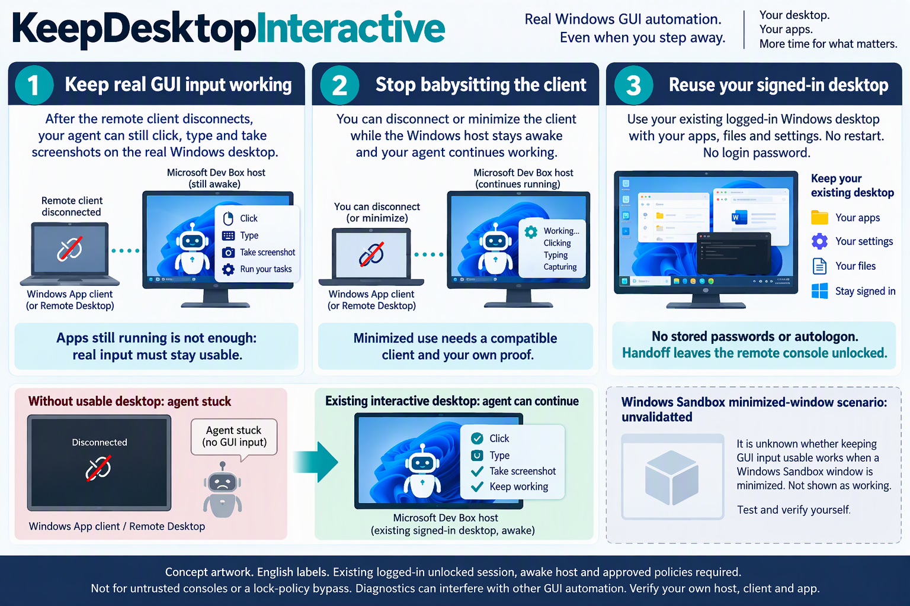

# KeepDesktopInteractive — RDP bağlantısı kesilince Windows GUI otomasyonunu sürdürün

RDP bağlantısı kesilince Windows GUI otomasyonu duruyor mu? Mevcut computer-use ajanlarının veya UI testlerinin tıklama, yazma ve ekran görüntüsü alma işlemleri için **zaten açılmış ve kilidi açık** bir oturumu koruyun. Küçültülmüş pencerede girişin durması ayrı bir durumdur; uyumlu istemci ve ayrı doğrulama gerektirir. Ajanlarla yerleşik entegrasyon, ajan başlatma, parola saklama veya otomatik oturum açma yoktur.

> **Aktarım uzak masaüstünü kilitsiz bırakır.** Fiziksel veya etkileşimli VM konsolunu kullanabilen biri Windows’ta oturum açmadan oturumu kullanabilir. Başkalarının erişebildiği ortak bilgisayarda veya güvenilmeyen konsolda kullanmayın. Kilitli ekranda otomasyon ya da ilke atlatma sağlamaz. [Kurulum ve erişim riskleri](../configuration.md).

[Kurulum ve erişim riskleri](#setup) → [Gerçek girdiyi doğrula](#proof) · [Sınırlar](#limits) · [Geri alma](#undo)

- Windows RDP bağlantısının kesildiğini algıladığında mevcut oturum konsola aktarılır; GUI girdisini sürdürmeye yardımcı olur.
- İşleme ayarı uyumlu istemcilerde küçültülmüş pencereye yardımcı olur; ayrıca test edin.
- Yalnızca açık uygulamalara değil, doğru moddaki özel sonuçlarla gerçek tıklama, yazma ve görüntü yakalamaya bakın.

<details>
<summary>Languages</summary>

[English](../../README.md) · [简体中文](README.zh-CN.md) · [繁體中文](README.zh-TW.md) · [日本語](README.ja.md) · [한국어](README.ko.md) · [Español](README.es.md) · [Português (Brasil)](README.pt-BR.md) · [Français](README.fr.md) · [Deutsch](README.de.md) · [Italiano](README.it.md) · [Русский](README.ru.md) · [Türkçe](README.tr.md) · [Tiếng Việt](README.vi.md) · [Bahasa Indonesia](README.id.md) · [हिन्दी](README.hi.md) · [العربية](README.ar.md)

</details>

<a id="setup"></a>

Kurulumdan önce ana makine açık, uyanık ve kilitsiz olmalı; ilkeler bu kullanıma izin vermelidir. Windows, yönetici onayı, Git, PowerShell 5.1 ve VBScript gereksinimleri aşağıdadır.

## İki bilgisayar

uzak ana makine, otomasyonu çalıştıran Windows PC/VM’dir; yerel istemci, RDP/Windows App çalıştıran Windows PC’dir. Windows PowerShell 5.1, VBScript ve klonlama için Git gerekir. Ana makinede kurulum yönetici onayı ister. Her iki bilgisayarda geçerli kullanıcının özel klasörüne yeni ve güvenilir bir kopya alın; ortak yazılabilir klasör kullanmayın.

```powershell
git clone https://github.com/yeelam-gordon/KeepDesktopInteractive.git "$env:LOCALAPPDATA\KeepDesktopInteractiveSource"
Set-Location "$env:LOCALAPPDATA\KeepDesktopInteractiveSource"
```

Her bilgisayarda klonlanan klasörü açıp komutları orada çalıştırın. İlk komut uzak ana makinede yönetici yetkisi onaylanarak, ikinci komut yerel istemcide çalıştırılır.

```powershell
wscript.exe .\start-desktop-session-setup.vbs
```

```powershell
wscript.exe .\set-local-rdp-minimize-rendering.vbs
```

Uzak istemciyi tamamen kapatıp yeniden açın ve tekrar bağlanın. [Kurulum sonuçları](../configuration.md#quick-setup): ana makinede `Installed: true`, `Status: Ready`; istemcide `Succeeded: true` olmalıdır.

<a id="proof"></a>

## İlk doğrulama

RDP bağlantısını normal şekilde kesin, 30 saniye bekleyip yeniden bağlanın; tanılama otomatik çalışır. Ayrı küçültme testi için aşağıdaki komutu uzak ana makinede çalıştırın, yerel istemcideki uzak pencereyi hemen küçültüp 90 saniye öyle bırakın, sonra geri açın. Test gerçek giriş ve ekran yakalamadan önce 60 saniye bekler.

```powershell
wscript.exe .\test-interactive-desktop-automation.vbs --minimized-test
```

Ana makinede yeni `%LOCALAPPDATA%\KeepDesktopInteractive\desktop-proof.json` dosyasını kontrol edin. Aşağıdakiler her test için beklenen alan örnekleridir; bu güncellemede ölçülmüş sonuçlar değildir:

```json
{ "Passed": true, "Mode": "AfterDisconnect" }
```

```json
{ "Passed": true, "Mode": "WhileClientMinimized" }
```

Küçültme testi yalnızca giriş ve ekran yakalama sırasında pencere küçültülmüş kalırsa geçerlidir; ana makine istemcinin durumunu göremez. Günlükleri ve görüntüleri gizli tutun; yakındaki masaüstü içeriğini gösterebilirler. [Doğrulama ayrıntıları](../configuration.md#verify-on-each-new-machine).



Kavramsal çizim: solda uygulamalar çalışır ama otomasyon takılır; sağda kurulum sonrası beklenen tıklama, yazma ve ekran yakalama vardır. Etiketler İngilizcedir; çevrilmiş uygulama arayüzü ya da canlı test değildir. Küçültme desteği istemciye bağlıdır; dizüstünü kapatma veya ağ kaybında Windows’un RDP kesilmesini algılaması gerekir. Konsol kilidi açık kalır; kendi kurulumunuzu doğrulayın. Yerel kilit yalnızca bakımcının bildirdiği çiftte, dizüstü bilgisayar uyanıkken ve istemci ayarı uygulanmışken geçti. Küçültülmüş pencere testi güvenlik sıkılaştırmasından önceydi; dağıtımdan sonra tekrarlanmadı.

<a id="limits"></a>

## Sınırlar

ayar klasik Remote Desktop Connection için belgelenmiştir; Windows App desteği sürüme bağlıdır. Bakım sorumlusunun bildirdiğine göre özgün istemci/ana makine çifti güvenlik sıkılaştırmasından önce küçültme testini geçmiştir, ancak dağıtımdan sonra tekrar doğrulanmamıştır. Bu, tüm istemcilerin desteklendiği anlamına gelmez. Yeniden başlatmadan sonra bir kez oturum açıp kilidi kaldırın, ardından uygulamaları ve otomasyonu başlatın. Grafik arayüzü olmayan masaüstleri kapsam dışıdır. Uzak kilit, uyku, kapanma ve oturum kapatma otomasyonu durdurabilir. [Tüm sınırlar](../configuration.md#requirements-and-limitations).

`Passed: false` ise `Error`, `Stage` ve günlükleri okuyun. Kanıt yoksa veya eskiyse kurulumu kontrol edip testi tekrarlayın. Küçültmeyi desteklemeyen istemcilerde pencereyi görünür bırakın ya da ayrı doğrulanan bağlantı kesme akışını kullanın. [Sorun giderme](../../README.md#if-the-proof-fails) · [Yapılandırma kontrolleri](../configuration.md#configuration-checks).

<a id="undo"></a>

## Geri alma

ilgili klon klasörlerinden çalıştırın. İlk komut uzak ana makinedeki zamanlanmış görevleri kaldırır; ikinci komut aynı yerel PC’de aynı kullanıcıyla istemci ayarlarını geri yükler.

```powershell
wscript.exe .\start-desktop-session-setup.vbs --uninstall
```

```powershell
wscript.exe .\set-local-rdp-minimize-rendering.vbs --restore
```

Geri yükleme gerekmeyene kadar istemcideki `%LOCALAPPDATA%\KeepDesktopInteractive\local-rdp-minimize-backup.json` dosyasını saklayın. İşlemler bağımsızdır, tanılama kanıtlarını silmez. [Geri alma](../configuration.md#undo) · [Esas İngilizce kılavuz](../configuration.md) · [İngilizce README](../../README.md).

<details>
<summary>Windows App / Microsoft Dev Box / Hyper-V</summary>

> **Uyarı: oturum konsola aktarıldığında uzak Windows masaüstü kilidi açık kalır. Fiziksel klavyeye veya VM’nin etkileşimli konsoluna erişen biri Windows’ta oturum açmadan oturumunuzu kullanabilir. Başkalarının yanına gelebileceği ortak bir PC’de kullanmayın. Hyper-V yöneticilerine ve VMConnect’i açabilen herkese güvenmeniz gerekir. Windows App bağlantı istemcisidir; Microsoft Dev Box yönetilen bulut iş istasyonudur. Risk ürünün kendisi değil, başkasının kilidi açık konsola erişmesidir. Güvenilmeyen kişiler için etkileşimli konsol erişimi olmayan, tek geliştiricili yönetilen bir ana makine ortak PC’den daha düşük risklidir. Microsoft Dev Box’ın böyle bir erişim sunduğunu varsaymayın. Kurum politikalarına uyun: bu araç kilitli uzak ekranın arkasında otomasyon sağlamaz, kilitleme politikalarını aşmaz.**

</details>
